# Employee Attendance — Data Analysis

## Overview

This folder contains the Jupyter Notebook used to perform exploratory data analysis, statistical analysis, and visualization on the cleaned Employee Attendance dataset.

The analysis focuses on employee attendance patterns, working hours, productivity, work modes, departments, employment types, and other workplace-related variables.

---

## Analysis Notebook

### Employee Data Analysis

The `Employee_DataAnalysis.ipynb` notebook contains the complete data analysis workflow, including exploratory analysis, visualization, correlation analysis, and statistical hypothesis testing.

[Open Employee Data Analysis Notebook in Google Colab](https://colab.research.google.com/drive/1OausWxHCzMGD6Le33BJ2RbxtAodRh2bI?usp=sharing)

---

## Analysis Workflow

The analysis covers the following areas:

- Dataset inspection
- Data type identification
- Missing value analysis
- Numerical summary statistics
- Distribution analysis
- Bivariate analysis
- Numerical vs categorical analysis
- Categorical analysis
- Multivariate analysis
- Pearson correlation analysis
- Independent samples t-test
- One-Way ANOVA
- Chi-Square test of independence

---

# Analysis Outputs

The following visualizations were generated from the Employee Data Analysis notebook. The images are stored in the `4_Reports/Analysis_Outputs` folder.

---

## 1. Distribution and Statistical Analysis

### 1. Analysis 01 — Distributions

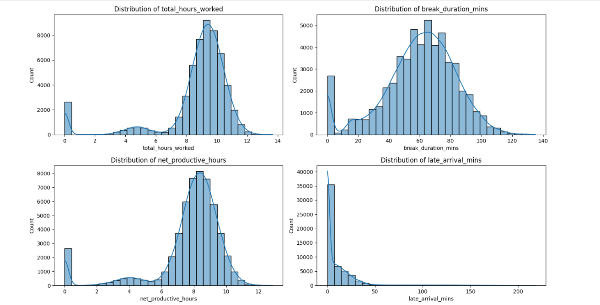

This analysis presents the distributions of important numerical variables in the employee attendance dataset. Histograms are used to examine the spread, concentration, and distribution patterns of attendance-related measures.

---

### 2. Analysis 01 — Distributions Part 2

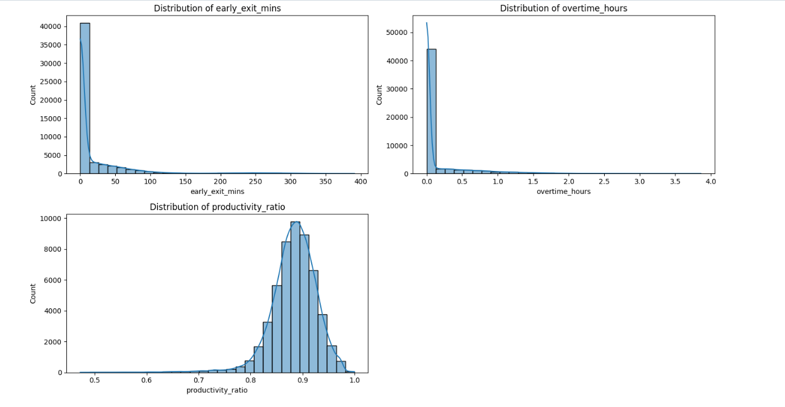

This analysis provides additional distribution visualizations for numerical attendance and productivity variables. It helps examine variation and distribution patterns of employee work-related measures.

---

### 3. Analysis 02 — Boxplots

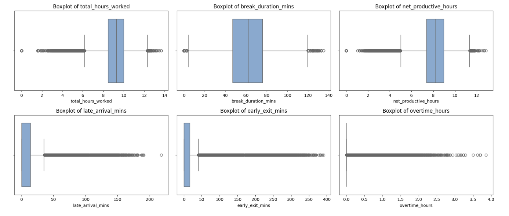

Boxplots are used to examine the central tendency, spread, and potential outliers in important numerical variables such as working hours, break duration, late arrival, early exit, and overtime.

---

### 4. Analysis 03 — Statistical Summary

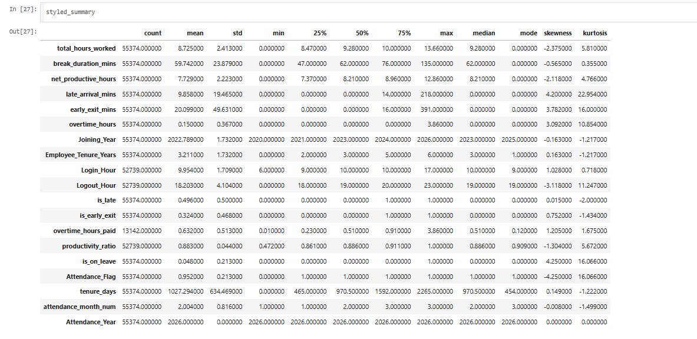

This analysis provides descriptive statistical summaries for numerical variables using measures such as mean, median, standard deviation, mode, skewness, and kurtosis.

---

### 5. Analysis 04 — Focused Statistics

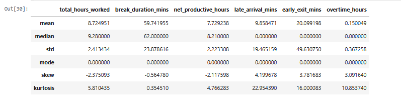

This analysis provides focused statistical information for selected numerical variables and supports a detailed understanding of employee working hours, productivity, attendance behavior, and related measures.

---

### 6. Analysis 05 — Categorical Distributions

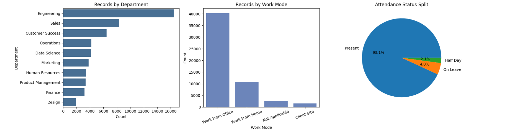

This analysis examines the distribution of important categorical variables such as department, work mode, and attendance status.

---

# 2. Bivariate Analysis

### 7. Analysis 06 — Total Hours vs Net Productive Hours

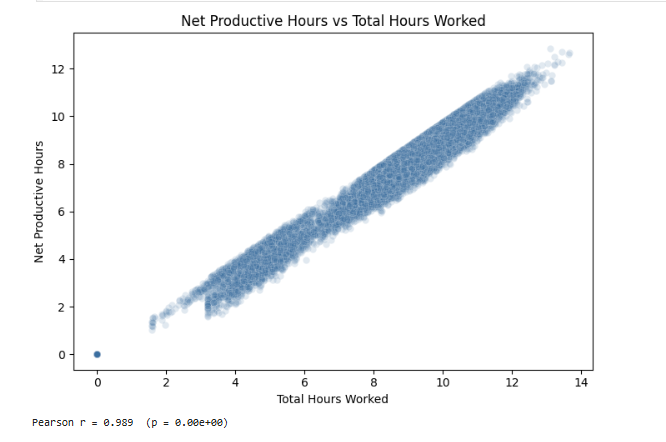

This analysis examines the relationship between total hours worked and net productive hours using a scatter plot and Pearson correlation analysis.

---

### 8. Analysis 07 — Overtime vs Net Productive Hours

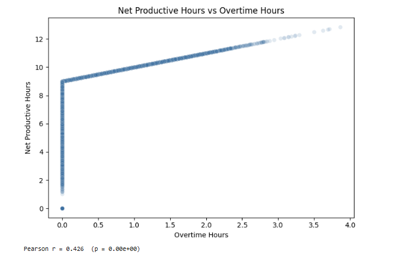

This analysis examines the relationship between overtime hours and net productive hours to explore productivity patterns associated with overtime.

---

### 9. Analysis 08 — Productivity Ratio vs Break Duration

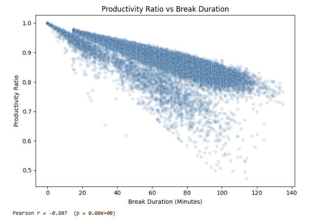

This analysis examines the relationship between break duration and productivity ratio.

---

### 10. Analysis 09 — Total Hours vs Late Arrival

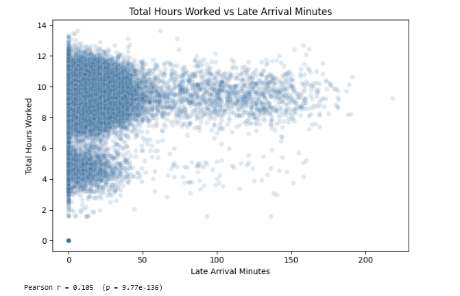

This analysis examines the relationship between total hours worked and late arrival minutes.

---

### 11. Analysis 10 — Net Productive Hours vs Early Exit

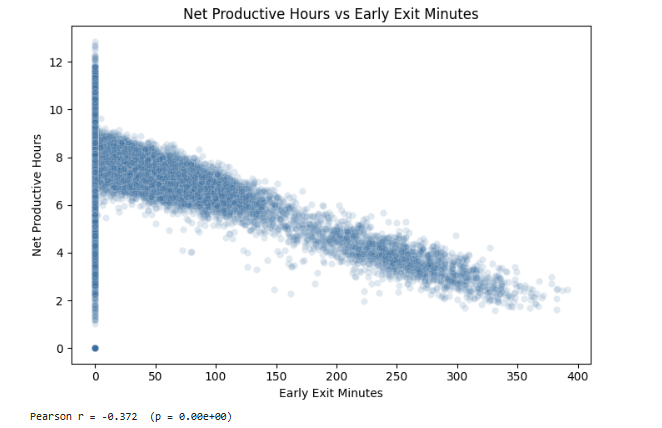

This analysis examines the relationship between early exit minutes and net productive hours.

---

# 3. Numerical vs Categorical Analysis

### 12. Analysis 11 — Late Arrival by Department

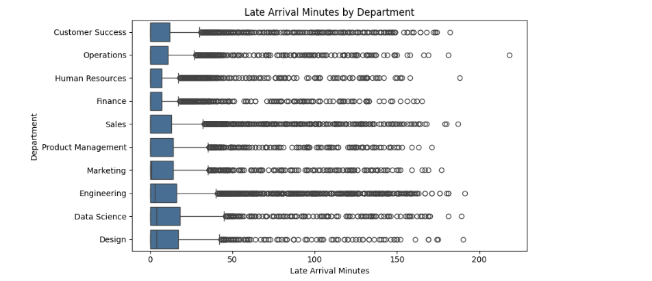

This analysis compares late arrival behavior across different departments.

---

### 13. Analysis 12 — Net Productive Hours by Work Mode

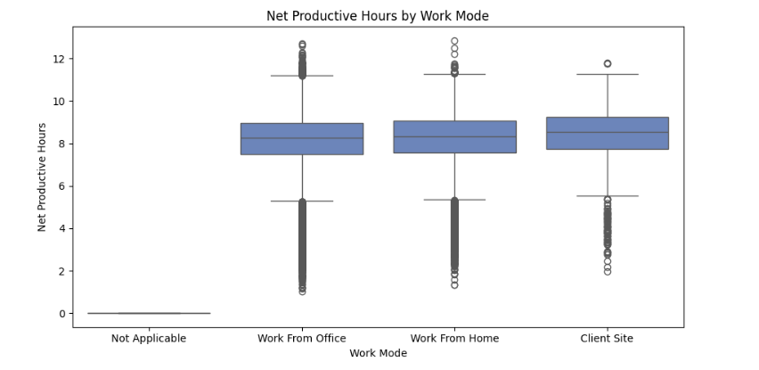

This analysis compares net productive hours across different work modes.

---

### 14. Analysis 13 — Net Productive Hours by Department

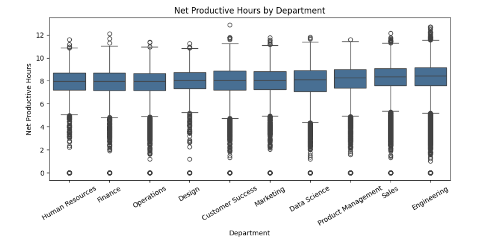

This analysis compares average net productive hours across departments and provides a department-level view of productive working time.

---

### 15. Analysis 14 — Overtime Hours by Department

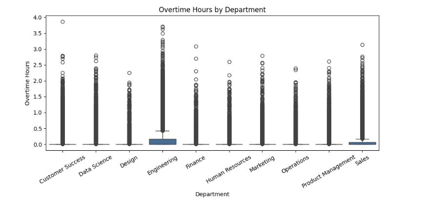

This analysis compares average overtime hours across departments and provides a department-level view of overtime patterns.

---

### 16. Analysis 15 — Productivity Ratio by Employment Type

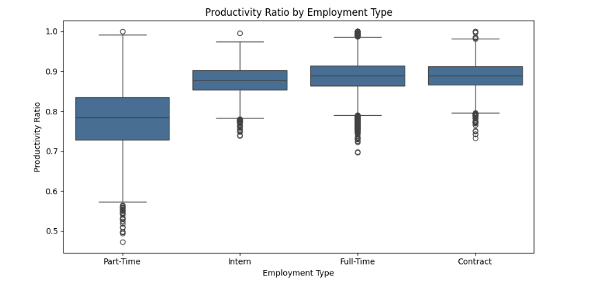

This analysis compares productivity ratio across different employment types, including full-time, contract, intern, and part-time employees.

---

# 4. Categorical Analysis

### 17. Analysis 16 — Work Mode Composition by Department

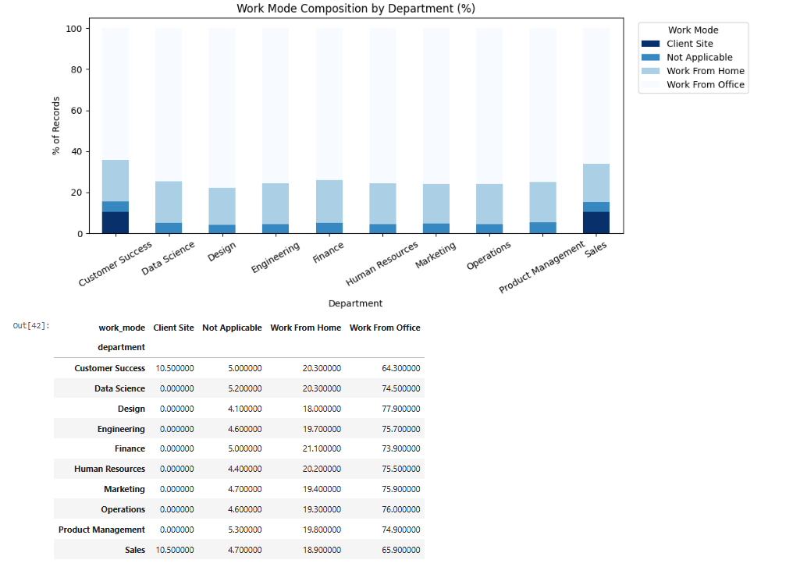

This analysis examines how different work modes are distributed across departments.

---

### 18. Analysis 17 — Attendance Status Composition by Department

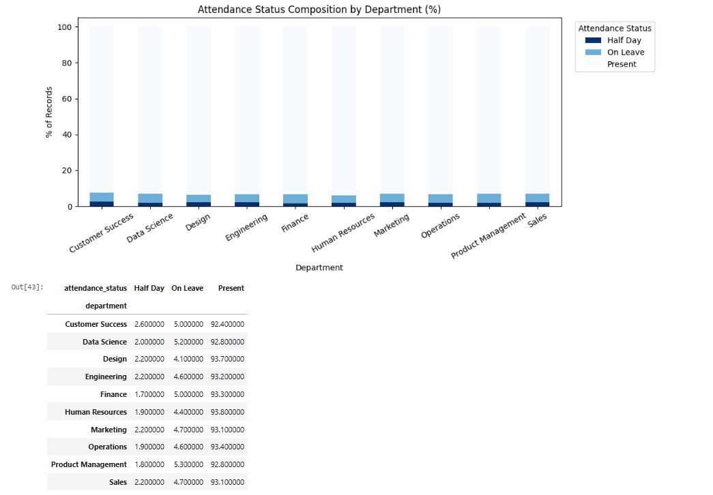

This analysis examines attendance status across departments, including Present, Half Day, and On Leave categories.

---

### 19. Analysis 18 — Attendance Status Composition by Shift Type

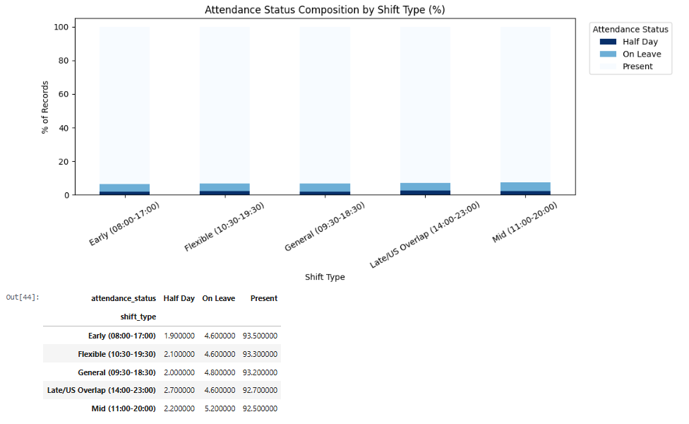

This analysis examines attendance status across different shift types and provides a comparison of attendance patterns.

---

### 20. Analysis 19 — Work Mode Composition by Employment Type

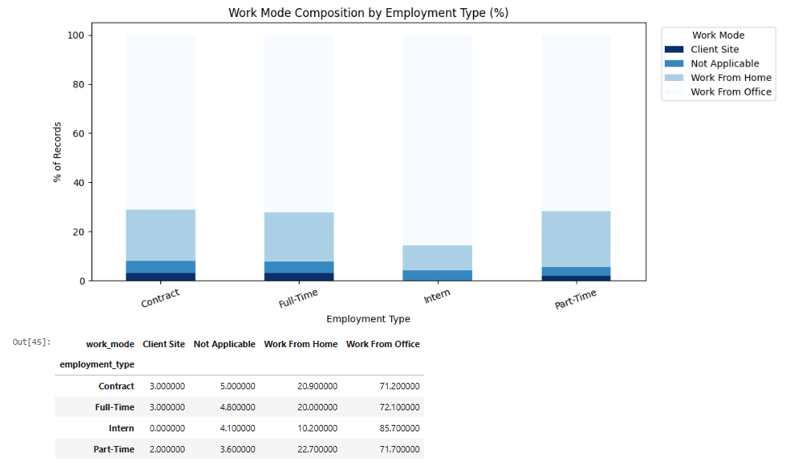

This analysis examines the composition of work modes across different employment types.

---

# 5. Multivariate Analysis

### 21. Analysis 20 — Pair Plot of Important Numerical Variables

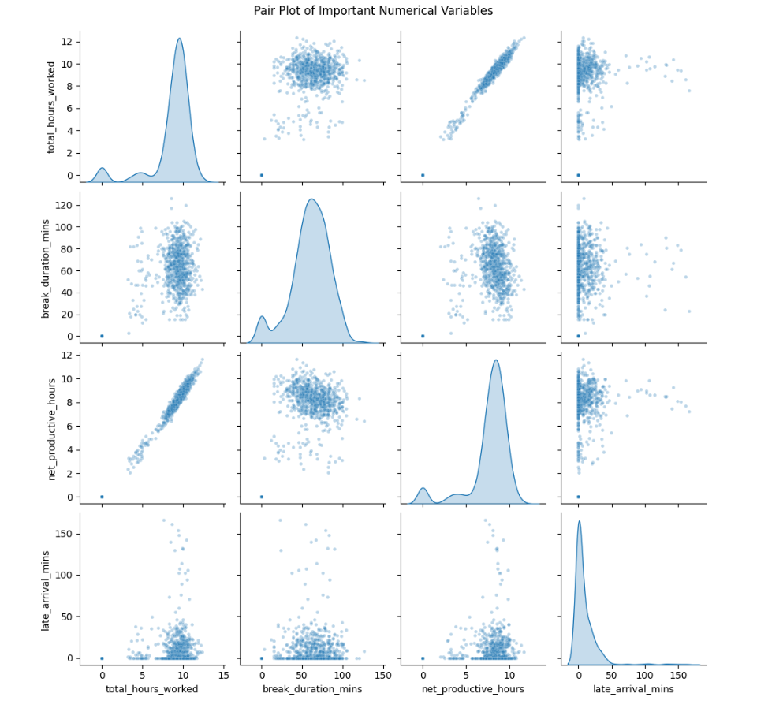

The pair plot provides a combined view of relationships and distributions among important numerical variables. It helps identify patterns and relationships between multiple variables.

---

### 22. Analysis 21 — Correlation Heatmap of Numerical Variables

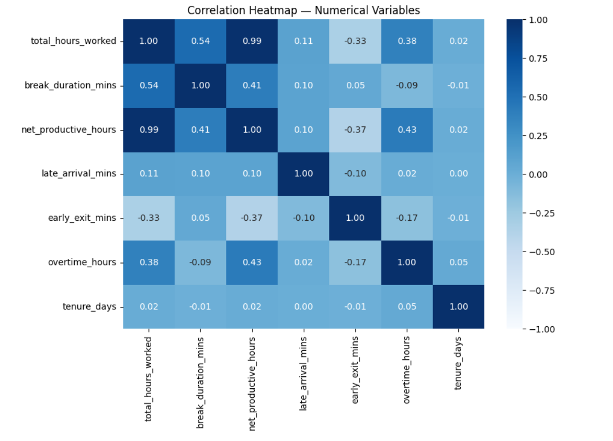

The correlation heatmap presents correlation coefficients between numerical variables and provides an overview of the strength and direction of their linear relationships.

---

### 23. Analysis 22 — Late Arrival by Department and Work Mode

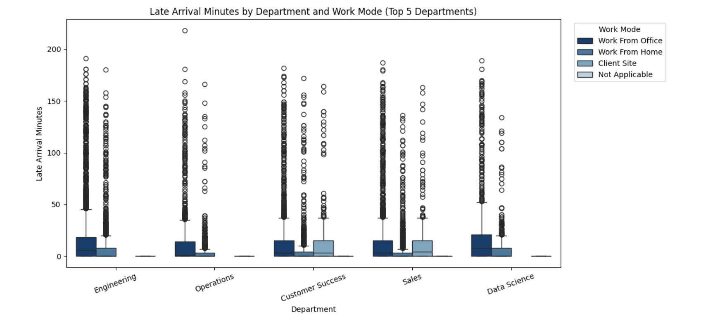

This analysis examines late arrival across departments while also considering work mode, providing a combined view of departmental and work-arrangement patterns.

---

### 24. Analysis 23 — Net Productive Hours Distribution by Top 5 Departments

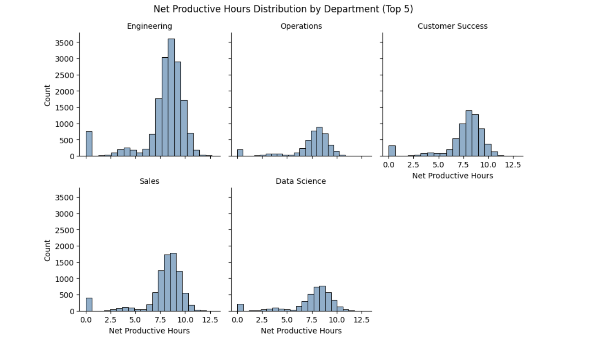

This analysis compares the distribution of net productive hours across the top five departments.

---

# 6. Statistical and Hypothesis Testing

### 25. Analysis 24 — Pearson Correlation Test

The Pearson correlation test measures the strength and direction of the linear relationship between selected numerical variables. The analysis reports the correlation coefficient and p-value.

---

### 26. Analysis 25 — Independent T-Test by Work Mode

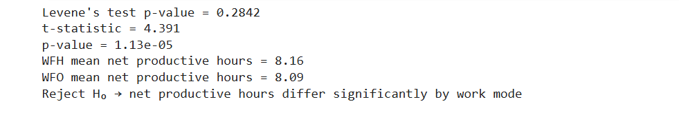

The independent samples t-test compares the mean of a numerical variable between two work-mode groups. Levene's test is also considered for variance equality.

---

### 27. Analysis 26 — One-Way ANOVA by Department

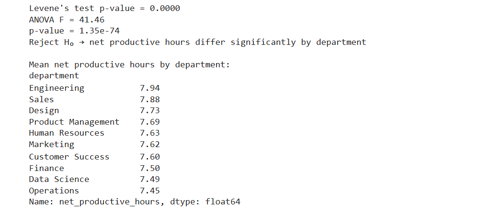

The one-way ANOVA test examines whether the mean of a numerical variable differs across multiple department groups. Levene's test is also used to assess variance homogeneity.

---

### 28. Analysis 27 — Chi-Square Test: Department and Work Mode

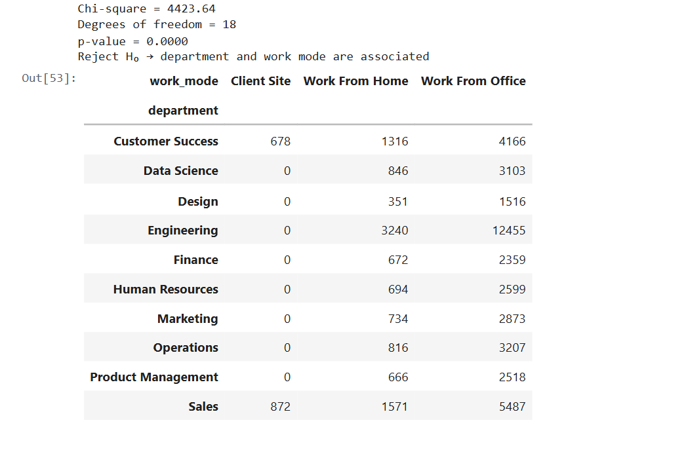

The Chi-Square test of independence examines the association between department and work mode by comparing the distribution of work modes across departments.

---

# Project Navigation

- [1. Dataset](../1_Dataset/)
- [2. Data Analysis](./)
- [3. Dashboards](../3_Dashboards/)
- [4. Reports](../4_Reports/)
