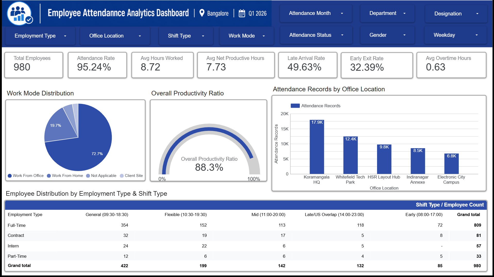
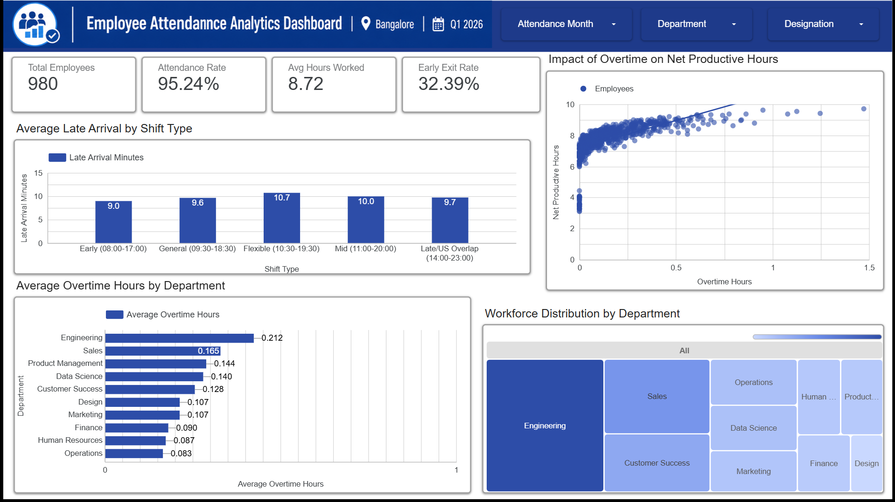
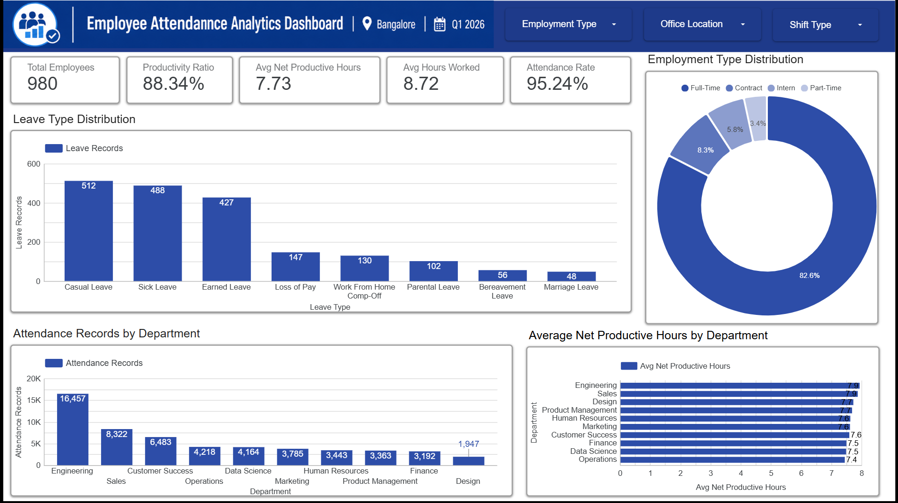

# Reports

This folder contains the final reporting outputs of the Employee Attendance Analytics project.

The reports are organized into two sections:

- `Analysis_Outputs` — visualizations, statistical summaries, and hypothesis-testing outputs generated from the data analysis notebook.
- `Dashboard_Images` — screenshots of the three pages of the Employee Attendance Analytics Dashboard.

---

## 1. Analysis Outputs

The `Analysis_Outputs` folder contains the outputs generated during the exploratory, statistical, bivariate, categorical, and multivariate analysis of the employee attendance dataset.

### Distribution and Statistical Analysis

1. [Analysis 01 - Distributions](Analysis_Outputs/Analysis_01_Distributions.png)

2. [Analysis 01 - Distributions Part 2](Analysis_Outputs/Analysis_01_Distributions_Part2.png)

3. [Analysis 02 - Boxplots](Analysis_Outputs/Analysis_02_Boxplots.png)

4. [Analysis 03 - Statistical Summary](Analysis_Outputs/Analysis_03_Statistical_Summary.png)

5. [Analysis 04 - Focused Statistics](Analysis_Outputs/Analysis_04_Focused_Statistics.png)

6. [Analysis 05 - Categorical Distributions](Analysis_Outputs/Analysis_05_Categorical_Distributions.png)

---

### Bivariate Analysis

7. [Analysis 06 - Total Hours vs Net Productive Hours](Analysis_Outputs/Analysis_06_Total_vs_Net_Productive.png)

8. [Analysis 07 - Overtime vs Net Productive Hours](Analysis_Outputs/Analysis_07_Overtime_vs_Net_Productive.png)

9. [Analysis 08 - Productivity Ratio vs Break Duration](Analysis_Outputs/Analysis_08_Productivity_Ratio_vs_Break_Duration.png)

10. [Analysis 09 - Total Hours vs Late Arrival](Analysis_Outputs/Analysis_09_Total_Hours_vs_Late_Arrival.png)

11. [Analysis 10 - Net Productive Hours vs Early Exit](Analysis_Outputs/Analysis_10_Net_Productive_vs_Early_Exit.png)

---

### Numerical vs Categorical Analysis

12. [Analysis 11 - Late Arrival by Department](Analysis_Outputs/Analysis_11_Late_Arrival_by_Department.png)

13. [Analysis 12 - Net Productive Hours by Work Mode](Analysis_Outputs/Analysis_12_Net_Productive_by_Work_Mode.png)

14. [Analysis 13 - Net Productive Hours by Department](Analysis_Outputs/Analysis_13_Net_Productive_by_Department.png)

15. [Analysis 14 - Overtime Hours by Department](Analysis_Outputs/Analysis_14_Overtime_Hours_by_Department.png)

16. [Analysis 15 - Productivity Ratio by Employment Type](Analysis_Outputs/Analysis_15_Productivity_Ratio_by_Employment_Type.png)

---

### Categorical Analysis

17. [Analysis 16 - Work Mode Composition by Department](Analysis_Outputs/Analysis_16_Work_Mode_Composition_by_Department.png)

18. [Analysis 17 - Attendance Status Composition by Department](Analysis_Outputs/Analysis_17_Attendance_Status_Composition_by_Department.png)

19. [Analysis 18 - Attendance Status Composition by Shift Type](Analysis_Outputs/Analysis_18_Attendance_Status_Composition_by_Shift_Type.png)

20. [Analysis 19 - Work Mode Composition by Employment Type](Analysis_Outputs/Analysis_19_Work_Mode_Composition_by_Employment_Type.png)

---

### Multivariate Analysis

21. [Analysis 20 - Pair Plot of Important Numerical Variables](Analysis_Outputs/Analysis_20_Pair_Plot_Important_Numerical_Variables.png)

22. [Analysis 21 - Correlation Heatmap of Numerical Variables](Analysis_Outputs/Analysis_21_Correlation_Heatmap_Numerical_Variables.png)

23. [Analysis 22 - Late Arrival by Department and Work Mode](Analysis_Outputs/Analysis_22_Late_Arrival_by_Department_and_Work_Mode.png)

24. [Analysis 23 - Net Productive Hours Distribution by Top 5 Departments](Analysis_Outputs/Analysis_23_Net_Productive_Hours_Distribution_by_Department_Top5.png)

---

### Statistical and Hypothesis Testing

25. [Analysis 24 - Pearson Correlation Test](Analysis_Outputs/Analysis_24_Pearson_Correlation_Test.png)

26. [Analysis 25 - Independent T-Test by Work Mode](Analysis_Outputs/Analysis_25_Independent_T_Test_Work_Mode.png)

27. [Analysis 26 - One-Way ANOVA by Department](Analysis_Outputs/Analysis_26_One_Way_ANOVA_Department.png)

28. [Analysis 27 - Chi-Square Test: Department and Work Mode](Analysis_Outputs/Analysis_27_Chi_Square_Department_Work_Mode.png)

---

## 2. Dashboard Images

The `Dashboard_Images` folder contains screenshots of the three pages of the Employee Attendance Analytics Dashboard created using Looker Studio.

### Page 1 — Dashboard Overview

### Page 2 — Productivity and Overtime Analysis

### Page 3 — Attendance and Workforce Analysis

---

## 3. Live Dashboard

The interactive dashboard is available through Looker Studio.

[Open Employee Attendance Analytics Dashboard](https://datastudio.google.com/reporting/ef773827-657e-4f0d-bcf9-c6d3325d0f47)

---

## 4. Analysis Notebook

The analysis outputs were generated from the Employee Data Analysis notebook.

[Open Employee Data Analysis Notebook in Google Colab](https://colab.research.google.com/drive/1OausWxHCzMGD6Le33BJ2RbxtAodRh2bI?usp=sharing)

The analysis covers:

- Dataset inspection
- Data type identification
- Missing value analysis
- Numerical summary statistics
- Distribution analysis
- Bivariate analysis
- Categorical analysis
- Multivariate analysis
- Pearson correlation analysis
- Independent samples t-test
- One-Way ANOVA
- Chi-Square test of independence

---

## 5. Project Navigation

- [1. Dataset](../1_Dataset/)
- [2. Data Analysis](../2_Data_Analysis/)
- [3. Dashboards](../3_Dashboards/)
- [4. Reports](./)