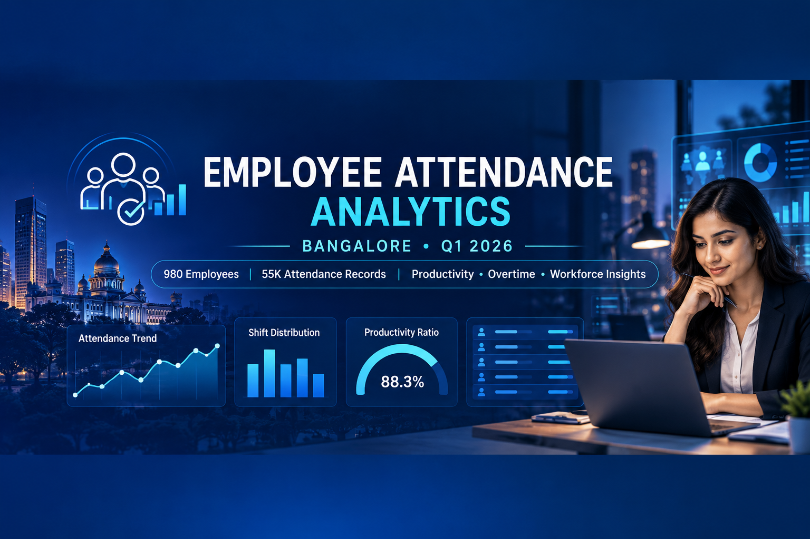

# Employee Attendance, Login & Logout Data — Bangalore

Employee attendance and productivity analytics for Bangalore Q1 2026 using Python, Pandas, statistical analysis, data visualization, and Looker Studio dashboards.

---

## Project Overview

The objective of this project is to analyze employee attendance, working hours, productivity, overtime, work modes, leave patterns, and workforce distribution for Bangalore during Q1 2026. The project aims to identify workforce patterns and provide meaningful insights through data cleaning, exploratory data analysis, statistical analysis, and interactive visualization.

The analysis is presented through an interactive **Employee Attendance Analytics Dashboard**, developed using Looker Studio and organized into three pages:

- **Page 1 — Attendance and Productivity Overview:** Summarizes employee attendance, working hours, productivity, work modes, and workforce distribution across office locations and shifts.

- **Page 2 — Shift, Overtime and Department Analysis:** Examines shift-wise late arrivals, overtime patterns, the relationship between overtime and net productive hours, and department-wise workforce distribution.

- **Page 3 — Leave and Department-Level Analysis:** Highlights leave patterns, employment type distribution, department-wise attendance records, and average net productive hours across departments.

The project follows a complete data analytics workflow:

- Raw dataset collection
- Data cleaning and preprocessing
- Feature engineering
- Exploratory data analysis
- Statistical analysis
- Data visualization
- Hypothesis testing
- Interactive dashboard development
- Reporting and documentation

---



---

## Dataset

The project uses an Employee Attendance dataset covering Bangalore for Q1 2026.

### Dataset Details

| Attribute | Details |
|---|---|
| Location | Bangalore |
| Period | Q1 2026 |
| Records | 55,374 |
| Employees | 980 |
| Departments | 10 |
| Raw Columns | 22 |
| Cleaned Columns | 41 |

The dataset contains employee information, attendance records, login and logout timestamps, working hours, break duration, productive hours, late arrival, early exit, overtime, work mode, shift type, and leave information.

---

## File Details

| File / Resource | Description | Link |
|---|---|---|
| Raw Dataset | Original employee attendance dataset for Bangalore, Q1 2026 | [Insert Raw Dataset Link](https://docs.google.com/spreadsheets/d/1jT9biitZJI6d6yCA7TTaTouqdqY65MFXj076heiqV5U/edit?usp=sharing) |
| Cleaned Dataset | Cleaned and processed employee attendance dataset used for analysis and dashboard development | [View Cleaned Dataset](PASTE_CLEANED_DATASET_LINK_HERE) |
| Data Cleaning Notebook (Google Colab) | Notebook containing data cleaning, preprocessing, and feature engineering steps | [View Data Cleaning Notebook](PASTE_DATA_CLEANING_COLAB_LINK_HERE) |
| Data Analysis Notebook (Google Colab) | Notebook containing exploratory data analysis, visualizations, and statistical analysis | [View Data Analysis Notebook](PASTE_DATA_ANALYSIS_COLAB_LINK_HERE) |
| Kaggle Notebook | Notebook covering both data cleaning and data analysis | [View Kaggle Notebook](PASTE_KAGGLE_NOTEBOOK_LINK_HERE) |
| Data Analysis Notebook (`.ipynb`) | Jupyter Notebook stored in the GitHub repository for the data analysis workflow | [View Analysis Notebook](PASTE_GITHUB_ANALYSIS_NOTEBOOK_LINK_HERE) |
| Interactive Dashboard | Looker Studio dashboard presenting attendance, productivity, overtime, workforce, and leave insights | [View Dashboard](PASTE_LOOKER_STUDIO_DASHBOARD_LINK_HERE) |
| Dashboard — Page 1 | Attendance and Productivity Overview | [View Page 1](PASTE_DASHBOARD_PAGE1_IMAGE_LINK_HERE) |
| Dashboard — Page 2 | Shift, Overtime and Department Analysis | [View Page 2](PASTE_DASHBOARD_PAGE2_IMAGE_LINK_HERE) |
| Dashboard — Page 3 | Leave and Department-Level Analysis | [View Page 3](PASTE_DASHBOARD_PAGE3_IMAGE_LINK_HERE) |


## Project Structure

```text
Employee-Attendance-Login-Logout-Data-Bangalore/
│
├── CoverPhoto_Employee.png
│
├── 1_Dataset/
│   ├── 1_Raw_Dataset/
│   │   ├── employee_attendance_bangalore_q1_2026.csv
│   │   └── README.md
│   │
│   ├── 2_Data Cleaning/
│   │   ├── Employee_Attendance_Bangalore_q1_2026(DataCleaning).ipynb
│   │   └── README.md
│   │
│   └── 3_Cleaned_Dataset/
│       ├── employee_attendance_dashboard_cleaned_new9.csv
│       └── README.md
│
├── 2_Data_Analysis/
│   ├── Employee_DataAnalysis.ipynb
│   └── README.md
│
├── 3_Dashboards/
│   ├── Employee_Attendance_Dashboard_Page1.png
│   ├── Employee_Attendance_Dashboard_Page2.png
│   ├── Employee_Attendance_Dashboard_Page3.png
│   └── README.md
│
├── 4_Reports/
│   ├── Analysis_Outputs/
│   ├── Dashboard_Images/
│   └── README.md
│
└── README.md
